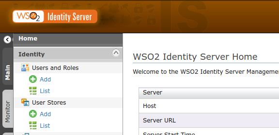

 # Remote User Store Management

A sample project on consuming a remote user database as a secondary user store for WSO2 Identity Server.

## Getting Started

This project consists of the two modules, agent and manager.

The agent module is the microservice wraps the user database. It provides with the endpoints for
[user management operations supported in the WSO2 Identity Server](https://docs.wso2.com/display/IS570/Writing+a+Custom+User+Store+Manager#WritingaCustomUserStoreManager-AbstractUserStoreManagerandimplementations).

The manager module is the custom user store manager for the WSO2 Identity Server to consume
the agent microservice in order to perform the [user management operations](https://docs.wso2.com/display/IS570/Writing+a+Custom+User+Store+Manager#WritingaCustomUserStoreManager-AbstractUserStoreManagerandimplementations).

This implementation demonstrate how to list all the available users within the remote user store database
in the WSO2 Identity Server.

### Prerequisites
* Extracted WSO2 Identity Server pack(Find the latest WSO2 IS pack from [here](https://wso2.com/identity-and-access-management/). We will call this extracted location as the ${IS_HOME}.
Please note that this sample has only been tested with the version, 5.7.0.
* A MySQL 5.7 database as the remote user database.

### Deploying the Sample

* Execute the following SQL queries to create the sample database table with sample user names.
```
CREATE TABLE UM_USER (
    UM_ID INT AUTO_INCREMENT primary key NOT NULL,
    UM_USER_NAME VARCHAR(255) NOT NULL
);
insert into UM_USER(UM_USER_NAME) VALUES("test-user-1");
insert into UM_USER(UM_USER_NAME) VALUES("test-user-2");
insert into UM_USER(UM_USER_NAME) VALUES("test-user-3");
```
* Go to the ${project.home} folder, "remote-user-store-management" and build the project using maven.
```
mvn clean install
```
* Copy the remote user store manager ${project.home}/manager/target/org.wso2.carbon.remote.user.store.manager-1.0-SNAPSHOT.jar
to the ${IS_HOME}/repository/components/dropins folder.
* Now let's start the microservice wrapping the UM_USER table we have created. Go to the ${project.home}/agent/target
 and copy the jar file 'org.wso2.carbon.remote.user.store.agent-1.0-SNAPSHOT.jar' to any desired place you like. We
 will call this location as the ${SERVICE_HOME}.
* Copy the ${project.home}/agent/src/main/java/resources/connection.properties file to the ${SERVICE_HOME}.
* Open the file connection.properties. Configure the database connectivity options as required to connect with the
UM_USER table.
* Configure the 'server.port' value to the desired port value. We will call this value as the ${service.port}.
* Start the microservice with the following command in the ${SERVICE_HOME} directory.
```
java -jar org.wso2.carbon.mote.user.store.agent-1.0-SNAPSHOT.jar connection.properties
```
* Now we will configure WSO2 Identity Server to consume this service. Start the Identity Server by executing the
following command in the ${IS_HOME} directory.
```
sh wso2server.sh
```
* Once server is started, login to the management console. In the leftmost side, click 'add' under the 'User Stores'
in the 'Identity' panel.

* Select 'org.wso2.carbon.remote.user.store.manager.WSUserStoreManager' as the user store manager class.
* Use any desired name as the user store domain. Ex: 'REMOTE-STORE'
* In the 'url' section, add the user store endpoint exposed with our microservice in the below format.
```
http://${server.host}:${server.port}/wso2agent
```
* Click on 'add'. It will take a few seconds until the new changes take effects.
* Now let's view all the users we did add in the UM_USER table. Click 'List' under 'Users and Roles' in the 'Identity'
panel.
* Click 'Users'.
* Set user store domain as the 'REMOTE-STORE' and then click 'Search Users'.
* You can view all the users we have added to the UM_USER table with the search results!

## Built With
* [Maven](https://maven.apache.org/) - Dependency Management
